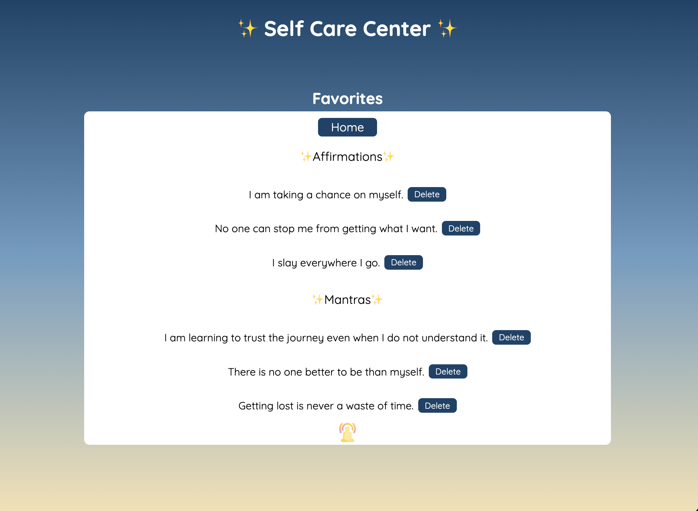

# Self-Care Center 

[Self-care-center](https://espressogoddess.github.io/self-care-center/)

## Abstract:
I built an app that allows users to receive random affirmation messages or mantra messages, depending upon which message type was chosen. Users can save their favorite messages and navigate to a favorited messages page to view them. Users can delete any of messages on the favorites page by clicking a delete button. 

## Installation Instructions:
1. Open your terminal.
1. Navigate to the directory where you would like this project to be stored.
1. Run `git clone git@github.com:Espressogoddess/self-care-source.git`.
1. Run `cd self-care-center` to move into the project directory.
1. Run `open index.html` in terminal to launch the application in the web browser.

## Preview of App:

## Context:
This project was completed in ~12 hours during my third week as a Turing student.

## Contributors:
[Amber](https://github.com/espressoGoddess)

## Learning Goals:
- Gain knowledge and experience building an app from scratch utilizing HTML, CSS, and JavaScript
- Know how to utilize HTML and CSS to match a provided comp
- Understand how to listen to and respond to user events
- Individualize my programming skill set

## Wins + Challenges:

### Wins
- A major win was figuring out the view logic for showing the message depending upon if affirmation or mantra was selected.
- A win was utilizing pseudocode to help with logic
- A win was also utilizing a feature branch that only implemented changes that aligned with that branch (which meant saving some features/changes for later while keeping the focus on the respective branch).

### Challenges
- It was challenging to effectively use CSS to alignment elements on the page to match the comp. I overcame this challenge with trial and error.
- It was challenging to wrap my head around the way in which to utilize the data model as the source of truth and using that to update the DOM. I compared and contrasted various approaches/solutions and analyzed them to figure out if it was using the DOM or data model and it began to make sense.

